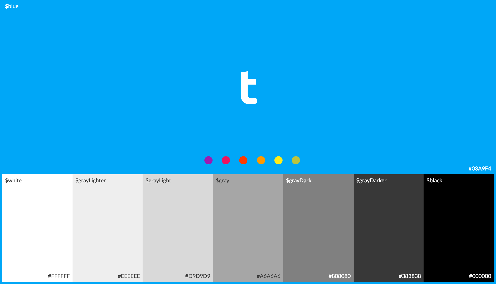

## TB-Colors: Simple can be powerful
A minimalist color palette for use in [TB-UI](https://www.github.com/teambition/tb-ui).



### Install
```
npm i tb-colors --save
```

### Enjoy Coloring

#### With Stylus
```
@import 'dist/colors'

.tb-logo
  color: $blue

```

### Todos
- Generate a SketchPalette file.
- Complete the documentations for multiple platforms.

### Inspirations & References
- [Trellicolors](https://github.com/trello/trellicolors) - Converts the Trello brand colors to various formats.
- [colors.css](https://github.com/mrmrs/colors) - Smarter defaults for colors on the web.

### License
This work is licensed under the MIT license.
